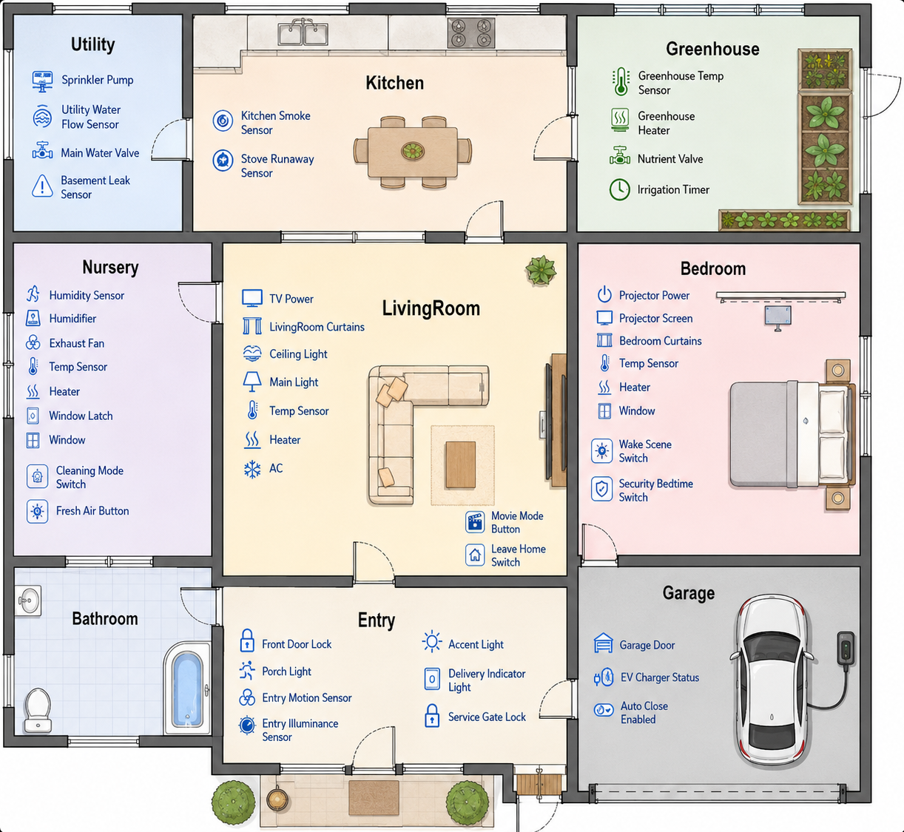

## HomeAgent

### 思考

1. 非预期状态为什么会发生？
  1. 规则关联模式角度：规则之间存在多样的关联模式，可能会导致非预期状态的发生
  2. 特殊情境：即使相同的规则关联模式，在不同情况下表现不同，例如R21与R22育儿室清洁模式开启后，如果是正常清洁，R22的开窗规则是没有问题的，但是如果是已经境界完成，但是忘记关闭清洁模式，那么R22的开窗规则就出现了问题
  3. 虚拟与现实的映射：R21如果是清洁模式，是否始终保持清洁模式？本工作前提是虚拟与现实的映射是正确的，但是规则对情景定义的不足会导致虚拟与现实的映射出现偏差，因此在这一方面应当避免
2. 解决方案：
  1. 规则关联模式：更新规则列表，迭代更新足够详细的情境，细化得到非预期状态的情境，从而进行避免，新设置的规则只能够依赖已有的设备，而不能新增,规则补全的目的是使得当前的规则能够很好地区分所有情境与非预期状态情境，因此判断标准也是如此，每次迭代都要给出当前的图，当前已经区分的情境，让AI查看是否还有特殊情景没有发现，如果有的话再尝试规则补全以进行情境区分
  2. 对于无法避免的情境，则使用处理策略,非预期状态处理策略的目的是处理发生的非预期状态情境
  3. 对于以上两种解决方案，都有个保底方案，即通知用户，例如长时间没有更改清洁模式，则设一个清洁模式半小时后，童锁如果disabled状态，则enable童锁，然后通知用户；对于处理策略，则是通知用户预期执行某个操作，是否同意，还是执行器其他操作

### TODO

- [X] 理论定义完备
  - [X] 设备实体
  - [X] 环境因素
  - [X] 触发器
  - [X] 条件
  - [X] 执行动作
  - [X] 规则模型
  - [X] 规则关联
  - [X] 规则关联图
    - [X] 节点定义
    - [X] 边定义
  - [X] 规则关联非预期结果定义（即违反实体常态配置）
  - [X] 非预期状态转换图（规则关联图根据实体常态配置得到的结果）
- [X] 方案设计【Agent+】
  - [X] zone+channel感知
  - [X] TCAE建模
  - [X] 规则关联图生成算法（静态代码分析）
  - [X] 非预期状态转换图生成算法（规则关联图根据实体常态配置得到的结果）
  - [ ] 非预期状态转换图迭代算法
    - [ ] 实例生成（寻找会产生非预期状态的情境实例）：相同的规则关联不一定会导致非预期状态，一些非预期结果仅仅实在特殊情况下发生，需要AI根据图与冲突处理策略生成仍旧存在的异常状态实例
    - [ ] 规则补全（包括**情境进行补齐**，用规则补全的方法对情境进行区分，从而避免情境补全导致的非预期状态的发生），例如R21与R22育儿室清洁模式开启后，久久没关闭，那么是否会出现是用户忘记关闭清洁模式，设定对应的规则避免这种情况，补全规则时只能复用已有的设备，而不能定义新的设备，如果设备实在不支持情境补齐，例如这里的车库自动关门模式没法通过定义打开，则采用保底规则：触发器是变成充电状态10分钟后，条件是车库门不允许自动关闭，动作是通知用户改变“车库门自动关闭许可”，然后图关联算法和非预期转换图生成要重新执行
    - [ ] 迭代以上两步流程直到所有的情境被查出且都有规则进行详细区分
  - [X] 规则补全不能够保证非预期状态不再出现，还是要搭配非预期状态处理策略，即预期状态处理策略生成算法（家庭环境上下文+产生关联的规则事件上下文+模板+AI判断），处理策略也有个保底：通知用户默认执行某个操作
  - [X] 图游走算法
- [X] 规则关联边定义与非预期状态实例设计（8+8）
  - [X] 触发（直接/间接） $\rightarrow 2$
  - [X] 条件（使允许/使禁用）（直接/间接） $\rightarrow 2\times 2=4$
  - [X] 执行动作（直接/间接）$\rightarrow 2$
- [ ] 实验与优化（反哺设计）
  - [ ] 之前定义的判断标准是：规则交互/冲突类型是否检测到，但是不同方案设计并不相同，因此结果展示效果不好
- [ ] 其他实验比对
  - [ ] 检测结果（设计的冲突是否检测出来）
  - [ ] 应对效果
  - [ ] 性能

### 环境配置

> Home Assistant

- 自动化 / 脚本 / 场景
  - `automations.yaml`
  - `scripts.yaml`
  - `scenes.yaml`
- Helper（辅助实体/虚拟设备）
  - `.storage/input_boolean`
  - `.storage/input_button`
  - `.storage/input_datetime`
  - `.storage/input_number`
  - `.storage/input_select`

> Home Agent

```
HomeAgent/
├── README.md                                     //项目说明与理论定义
├── 关键词.md                                      //术语维护文件
│
└── src/
    ├── .env                                      //隐私配置，不读取、不提交
    ├── .env.example                              //隐私配置模板
    │
    ├── common.py                                 //公共工具：读配置、路径拼接、读写JSON/YAML、加载.env、调用AI
    │
    ├── 1_extract_devices_and_bind_channels.py    //提取规则实体，并用AI绑定设备影响的channel
    ├── 2_bind_zones_and_build_tcae.py            //用户输入zone，并生成TCAE规则模型
    ├── 3_build_rule_association_graph.py         //根据TCAE生成规则关联图
    ├── 4_generate_normal_config.py               //用AI生成实体常态配置
    ├── 5_build_unexpected_state_transition_graph.py //根据常态配置剪枝生成非预期状态转换图
    ├── 6_iterative_refinement_plan.py            //非预期状态图迭代算法
    ├── 7_generate_resolution_rules.py            //非预期状态处理策略算法
    │
    ├── configurations/
    │   ├── config.json                           //系统配置文件
    │   ├── automations.yaml                      //Home Assistant自动化规则
    │   ├── core.entity_registry                  //Home Assistant实体映射
    │   │
    │   └── home/
    │       ├── devices.json                      //脚本1输出：从规则中提取的实体信息
    │       ├── channels.json                     //脚本1输出：设备-channel绑定结果
    │       ├── zones.json                        //脚本2输出：设备-zone绑定结果
    │       ├── tcae.json                         //脚本2输出：TCAE规则模型
    │       ├── rule_association_graph.json       //脚本3输出：规则关联图
    │       ├── normal_config.json                //脚本4输出：实体常态配置
    │       ├── unexpected_state_transition_graph.json //脚本5输出：非预期状态转换图
    │       └── resolution_rules.json             //脚本6输出：非预期结果处理规则
    │
    └── images/
        ├── rule_association_graph.png            //脚本3输出：规则关联图图片
        └── unexpected_state_transition_graph.png //脚本5输出：非预期状态转换图图片
```

`.env`：

```
# 系统变量

HomeAssistant_IP=192.168.77.4
HomeAssistant_PORT=8123

HomeAgent_IP=192.168.77.254
HomeAgent_PORT=8081

USER = cst-zyd
PASS = zyd

AI_MODEL= deepseek-4-flash
AI_API_URL = https://api.deepseek.ai/v1
AI_API_KEY = sk-xxx
```

### 基础定义

$$
\text{TCAE规则模型}
\Rightarrow
\text{规则关联图}
\Rightarrow
\text{实体常态配置}
\Rightarrow
\text{非预期状态转换图}
\Rightarrow
\text{动态图游走验证与处理}
$$

#### 原子定义

##### 基本集合

- $\mathcal{Z}$：区域（zone）的有限集合；
- $\mathcal{C}$：物理通道（channel）的有限集合；
- $\mathcal{E}$：实体（entity）的有限集合;
  - 对于每个实体 $e \in \mathcal{E}$，定义其状态域为：$\mathcal{V}_e$，例如：
    - 开关类实体：$\mathcal{V}_e = \{\texttt{on}, \texttt{off}\}$；
    - 数值类实体：$\mathcal{V}_e \subseteq \mathbb{R}$。
- $\mathcal{E}_a \subseteq \mathcal{E}$：可执行动作的实体集合；
- $\mathcal{E}_s \subseteq \mathcal{E}$：可观测实体集合。
- $\mathbb{T}$：表示时间域，例如离散时间域或连续时间域。

##### 离散实体状态空间

- 整个系统的离散实体状态空间定义为：$\mathcal{X} = \prod_{e \in \mathcal{E}} \mathcal{V}_e$
- 任意时刻的离散实体状态记为：$x : \mathbb{T} \to \mathcal{X}$
  - $x(t)$ 是时刻 $t$ 的离散实体状态
  - $x(t)(e)$ 是实体 $e$ 在时刻 $t$ 的值

##### 环境状态空间

- 对每个通道 $c \in \mathcal{C}$，定义其值域：$\mathcal{D}_c \subseteq \mathbb{R}$
- 环境状态空间定义为：$\mathcal{Y} = \prod_{(z,c)\in \mathcal{Z}\times\mathcal{C}} \mathcal{D}_c$
- 任意时刻的环境状态记为：$y:\mathbb{T}\to\mathcal{Y}$
  - 其中 $y(t)$ 是时刻 $t$ 的环境状态
  - $y(t)(z,c)$ 是时刻 $t$ 区域 $z$ 中通道 $c$ 的值

##### 全局混合状态

- 系统在时刻 $t$ 的全局状态定义为：$\sigma(t) = (x(t), y(t))$
- 总状态空间为：$\Sigma = \mathcal{X} \times \mathcal{Y}$

##### 实体状态原子谓词

- 对于实体 $e \in \mathcal{E}$、关系符 $\bowtie \in \{=,\neq,<,\le,>,\ge\}$、值 $v \in \mathcal{V}_e$，定义实体状态原子谓词：$P_{e,\bowtie,v}(\sigma(t))\overset{\text{def}}{\Longleftrightarrow}x(t)(e)\;\bowtie v$
  - 例如 $P_{\texttt{doorlock},=,\texttt{unlocked}}(\sigma(t))$ 表示“门锁在时刻 $t$ 为 unlocked”。

##### 实体状态跃迁原子谓词

> 该谓词用于刻画状态型触发器。

- 对于实体 $e \in \mathcal{E}$、前后状态 $v_1,v_2 \in \mathcal{V}_e$，定义：$\Delta P_{e,v_1\to v_2}(\sigma(t^-),\sigma(t))\overset{\text{def}}{\Longleftrightarrow}x(t^-)(e)=v_1 \land x(t)(e)=v_2$

##### 环境状态原子谓词

对于区域 $z \in \mathcal{Z}$、通道 $c \in \mathcal{C}$、关系符 $\bowtie$、阈值 $\theta \in \mathcal{D}_c$，定义：

- $Q_{z,c,\bowtie,\theta}(\sigma(t))\overset{\text{def}}{\Longleftrightarrow}y(t)(z,c)\;\bowtie\;\theta$
  - 例如：$Q_{\texttt{bedroom},\texttt{temperature},\ge,30}(\sigma(t))$ 表示“卧室温度不低于 30”。
  - $\bowtie \in \{<,\le,>,\ge\}$

##### 环境阈值穿越原子谓词

> 为了刻画 numeric trigger，定义“阈值穿越事件”。

- **上穿阈值**: $\Delta Q^{\uparrow}_{z,c,\theta}(\sigma(t^-),\sigma(t))\overset{\text{def}}{\Longleftrightarrow}y(t^-)(z,c) < \theta \land y(t)(z,c) \ge \theta$
- **下穿阈值**: $\Delta Q^{\downarrow}_{z,c,\theta}(\sigma(t^-),\sigma(t))\overset{\text{def}}{\Longleftrightarrow}y(t^-)(z,c) > \theta \land y(t)(z,c) \le \theta$

##### 时间原子谓词

- 定义$\Omega$时间约束集合，且$\omega \in \Omega$
- 对任意时间约束 $\omega$，定义时间谓词：$H_{\omega}(t)$
  - 例如：
    - $H_{=19:00}(t)$
    - $H_{\in [19:00,23:00]}(t)$

#### TCAE 模型定义

##### Trigger定义

- 一条规则的 Trigger 作用于“状态变化事件”，定义为：$T_r : \Sigma \times \Sigma \times \mathbb{T} \to \{0,1\}$
  - 即：$T_r(\sigma(t^-), \sigma(t), t)$ 表示规则 $r$ 是否在时刻 $t$ 被触发。
- 若规则 $r$ 有 $m_r$ 个触发项，则定义：$T_r = \bigvee_{i=1}^{m_r} \varphi_{r,i}$
  - 其中每个 $\varphi_{r,i}$ 是由以下原子构成的布尔公式：
    - $\Delta P_{e,v_1\to v_2}$
    - $\Delta Q^{\uparrow}_{z,c,\theta}$
    - $\Delta Q^{\downarrow}_{z,c,\theta}$
    - $H_\omega$

##### Condition 的定义

- Condition 是对当前状态的约束，定义为：$C_r : \Sigma \times \mathbb{T} \to \{0,1\}$
  - 即：$C_r(\sigma(t), t)$
- 若规则 $r$ 有 $n_r$ 个条件项，则定义：$C_r = \bigwedge_{j=1}^{n_r} \psi_{r,j}$
  - 其中每个 $\psi_{r,j}$ 是由以下原子构成的布尔公式：
    - $P_{e,\bowtie,v}$
    - $Q_{z,c,\bowtie,\theta}$
    - $H_\omega$

##### Action 的定义

Action 不是谓词，而是状态变换。

- 定义 $\mathcal{A}$ 表示所有原子动作的集合
- 每个原子动作可以抽象为：$a=(e,\textsf{op},v)$其中：

  - $e\in\mathcal{E}_a$
  - $\textsf{op}$ 为动作类型
  - $v$ 为目标值或参数
- 设规则 $r$ 的动作序列为：$A_r = \langle a_{r,1}, a_{r,2}, \dots, a_{r,\ell_r} \rangle$
- 每个动作 $a$ 形式化为一个部分状态变换：$\delta_a : \mathcal{X} \to \mathcal{X}$

  - 例如，若动作 $a=(e,\textsf{set},v)$ 表示将实体 $e$ 设置为值 $v$，则其变换定义为：

  $$
  \delta_a(x)(u)=
      \begin{cases}
      v, & u=e \\
      x(u), & u\neq e
      \end{cases}
  $$
- 规则 $r$ 的动作序列对应的整体离散状态变换为：$\delta_{A_r}=\delta_{a_{r,\ell_r}}\circ\delta_{a_{r,\ell_r-1}}\circ \cdots \circ\delta_{a_{r,1}}$

##### Environment 的定义

这里把 Environment 分成三部分：

- $E_r^T$：Trigger 对环境的引用；
- $E_r^C$：Condition 对环境的引用；
- $E_r^A$：Action 对环境的效应。

###### 环境引用项

- 定义环境引用原子集合 $\mathcal{R}_{env}$，每个环境引用项写为：$\rho = (z,c,\bowtie,\theta)$，$\bowtie \in \{<,\le,>,\ge,\uparrow,\downarrow\}$
  - 其中状态型引用有：$\bowtie\in\{<,\le,>,\ge\}$
  - 事件型引用有：$\bowtie\in\{\uparrow,\downarrow\}$
- 其语义定义为：$\llbracket \rho \rrbracket (\sigma(t))\overset{\text{def}}{\Longleftrightarrow}Q_{z,c,\bowtie,\theta}(\sigma(t))$
- 若是 trigger 中的阈值穿越项，则可写为：
  - 上穿型引用: $\rho = (z,c,\uparrow,\theta), \qquad \llbracket \rho \rrbracket(\sigma(t^-),\sigma(t)) \overset{\text{def}}{\Longleftrightarrow}\Delta Q^{\uparrow}_{z,c,\theta}(\sigma(t^-),\sigma(t))$
  - 下穿型引用: $\rho = (z,c,\downarrow,\theta), \qquad \llbracket \rho \rrbracket(\sigma(t^-),\sigma(t)) \overset{\text{def}}{\Longleftrightarrow} \Delta Q^{\downarrow}_{z,c,\theta}(\sigma(t^-),\sigma(t))$
- 环境引用项集合：$\operatorname{RefEnv}(F)=\{\rho\in\mathcal{R}_{env}\mid \rho \text{ appears in } F\}$，表示公式 $F$ 中出现的全部环境引用项的集合。

###### 环境效应项

- 定义**环境效应原子集合** $\mathcal{F}_{env}$。每个环境效应项定义为：$\eta = (z_s,\mathcal{R},c,s,\mu,\lambda,d)$，$s \in \{+1,-1\}$
  - 其中：
    - $z_s \in \mathcal{Z}$：源区域；
    - $\mathcal{R} \subseteq \mathcal{Z}$：该效应可传播到的区域集合；
    - $c \in \mathcal{C}$：受影响的通道；
    - $s \in \{+1,-1\}$：变化方向；
    - $\mu \in \mathbb{R}_{\ge 0}$：最小影响强度；
    - $\lambda \in \mathbb{R}_{\ge 0}$：生效延迟；
    - $d \in \mathbb{R}_{>0}$：持续时间。
- 若动作于时刻 $t$ 执行，并产生环境效应: $\eta = (z_s,\mathcal{R},c,s,\mu,\lambda,d)$
- 语义定义为: $\forall z \in \mathcal{R},\exists t' \in [t+\lambda,\; t+\lambda+d]\text{ s.t. }s\cdot\bigl(y(t')(z,c)-y(t)(z,c)\bigr)\ge \mu$，该定义刻画最弱环境可达影响
  - 表示：
    - 若 $s=+1$，则该通道值在传播窗口内至少上升 $\mu$；
    - 若 $s=-1$，则该通道值在传播窗口内至少下降 $\mu$。
- **动作到环境效应的映射**
  - 定义环境模型函数：$\Gamma : \mathcal{A} \to 2^{\mathcal{F}_{env}}$
  - 其中 $\mathcal{A}$ 为所有可能动作的集合，规则 $r$ 的**动作环境效应集合**定义为：$E_r^A = \bigcup_{a\in A_r}\Gamma(a)$

##### TCAE 模型

- 一条规则 $r$ 定义为：$r = \langle T_r,\; C_r,\; A_r,\; E_r \rangle$
  - 其中 $E_r = (E_r^T,\; E_r^C,\; E_r^A)$
    - Trigger 的环境引用集: $E_r^T = \operatorname{RefEnv}(T_r)$
    - Condition 的环境引用集: $E_r^C = \operatorname{RefEnv}(C_r)$
    - Action 的环境效应集: $E_r^A = \bigcup_{a\in A_r}\Gamma(a)$
- 完整的 TCAE 规则如下：$\boxed{r = \langle T_r,\; C_r,\; A_r,\; (E_r^T,E_r^C,E_r^A)\rangle}$
- 规则 $r$ 在时刻 $t$ 被触发，当且仅当: $\operatorname{Trig}(r,t)\overset{\text{def}}{\Longleftrightarrow}T_r(\sigma(t^-),\sigma(t),t)=1$
- 规则 $r$ 在时刻 $t$ 条件满足，当且仅当: $\operatorname{Cond}(r,t)\overset{\text{def}}{\Longleftrightarrow}C_r(\sigma(t),t)=1$
- 规则 $r$ 在时刻 $t$ 执行
  - 当且仅当: $\operatorname{Fire}(r,t)\overset{\text{def}}{\Longleftrightarrow}\operatorname{Trig}(r,t)\land \operatorname{Cond}(r,t)$
  - 执行后，其离散实体状态更新为: $x(t^+) = \delta_{A_r}(x(t))$
  - 其环境状态则在后续时间区间内满足环境效应约束。记为：$y_r(t \rightsquigarrow t') \models E_r^A$
    - $y_r(t\rightsquigarrow t')$ 表示规则 $r$ 在 $[t,t']$ 上诱导的环境轨迹；
    - 符号 $\models$ 表示该环境轨迹满足环境效应集合 $E_r^A$ 中每个效应项的约束。

##### 环境摘要

> 为了后续定义规则交互公式，我们还需要把环境引用与环境效应统一映射成可比较的“摘要”。

- 环境引用摘要（来自 Trigger / Condition 对环境的依赖）

  - 对环境引用项 $\rho$，定义其摘要函数: $\operatorname{sum}(\rho) = (z,c,\operatorname{dir}(\rho))$
  - 其中方向函数定义为：

  $$
  \operatorname{dir}(z,c,\ge,\theta)=+1,\qquad
  \operatorname{dir}(z,c,>,\theta)=+1
  $$

  $$
  \operatorname{dir}(z,c,\le,\theta)=-1,\qquad
  \operatorname{dir}(z,c,<,\theta)=-1
  $$

  $$
  \operatorname{dir}(z,c,\uparrow,\theta)=+1,\qquad
  \operatorname{dir}(z,c,\downarrow,\theta)=-1
  $$
- Trigger 的环境引用摘要: $\widehat{E}_r^T=\{\operatorname{sum}(\rho)\mid \rho\in E_r^T\}$
- Condition 的环境引用摘要: $\widehat{E}_r^C=\{\operatorname{sum}(\rho)\mid \rho\in E_r^C\}$
- 环境效应摘要（来自 Action 对环境的影响）

  - 对环境效应项$\eta=(z_s,\mathcal{R},c,s,\mu,\lambda,d)$，定义其对目标区域 $z\in\mathcal{R}$ 的投影摘要为：$\operatorname{proj}(\eta,z)=(z,c,s)$
  - 定义规则 $r$ 的动作环境摘要集合: $\widehat{E}_r^A=\bigcup_{\eta=(z_s,\mathcal{R},c,s,\mu,\lambda,d)\in E_r^A}\{\operatorname{proj}(\eta,z)\mid z\in\mathcal{R}\}$

#### 规则关联图相关定义

##### 节点定义

> 节点类型包括“触发器节点”、“条件节点”、“动作节点”与“环境节点”

- 设规则集合为：$\mathcal{R}=\{r_1,r_2,\dots,r_n\}$
- 每条规则仍采用 TCAE 表示：$r=\langle T_r,C_r,A_r,(E_r^T,E_r^C,E_r^A)\rangle$
- 由于规则间的关联的多样性，因此将规则 $r$ 拆分为组件节点
- 规则关联图的节点集合定义为：$V=V^T\cup V^C\cup V^A\cup V^E$

###### 触发器节点

- 对每条规则 $r$，定义其触发器节点为：$v_r^T$，表示规则 $r$ 的触发器部分 $T_r$
- 触发器节点集合为：$V^T=\{v_r^T\mid r\in\mathcal{R}\}$

###### 条件节点

- 若规则 $r$ 存在非空条件 $C_r$，定义其条件节点为：$v_r^C$
- 条件节点集合为：$V^C=\{v_r^C\mid r\in\mathcal{R},\ C_r\neq \emptyset\}$
- 其中 $C_r\eq \emptyset$ 表示规则没有条件

###### 动作节点

- 对每条规则 $r$，定义其动作节点为：$v_r^A$
- 表示规则 $r$ 的执行动作序列 $A_r$。
- 动作节点集合为：$V^A=\{v_r^A\mid r\in\mathcal{R}\}$

###### 环境节点

> 环境参数节点不属于某条规则，而属于系统环境。

- 对任意区域 $z\in\mathcal{Z}$ 和通道 $c\in\mathcal{C}$，定义环境参数节点：
  - $v_{z,c}^E$，表示区域 $z$ 中的物理通道 $c$。
- 环境参数节点集合为：$V^E=\{v_{z,c}^E\mid z\in\mathcal{Z},\ c\in\mathcal{C},\ (z,c)\text{ appears in some }E_r^T,E_r^C,E_r^A\}$

##### 边定义

> 规则关联图中的边分为两类：
>
> - **规则内部边**：规则自身执行流程带来的边；
> - **规则关联边**：不同规则组件或环境参数之间的潜在影响关系。
> - 因此边集合定义为：$E=E^{intra}\cup E^{assoc}$

###### 规则内部边

> 规则内部边表示规则自身的控制流，不代表规则之间的关联。

- 有条件规则:
  - 若规则 $r$ 有显式条件，即 $C_r\neq \emptyset$，则加入两条内部边：$(v_r^T,v_r^C)\in E^{intra}$、$(v_r^C,v_r^A)\in E^{intra}$
  - 表示：$T_r \rightarrow C_r \rightarrow A_r$，即触发器满足后检查条件，条件满足后执行动作。
- 无条件规则:
  - 若规则 $r$ 没有显式条件，即 $C_r=\emptyset$，则加入一条内部边：$(v_r^T,v_r^A)\in E^{intra}$
  - 表示：$T_r \rightarrow A_r$，即触发器满足后直接执行动作。

###### 规则关联边

> 规则关联边表示某个规则的动作可能影响其他规则的触发器、条件、动作，或者影响环境参数。

- 所有关联边都带有一个方向标签：$\operatorname{pol}(e)\in\{+1,-1\}$，其中：
  - $\operatorname{pol}(e)=+1$ 表示促进、满足、增强、趋向同向；
  - $\operatorname{pol}(e)=-1$ 表示抑制、破坏、削弱、趋向反向。
- 规则内部边可视为中性传播边，其极性为：$\operatorname{pol}(e)=+1$，该极性只用于路径极性计算，不表示规则内部边属于规则关联边。

###### 规则关联边类型

> 规则关联边按照影响方式分为九类，命名如下：

$$
E^{assoc}
=

E^{DT}
\cup E^{ET}
\cup E^{DCA}
\cup E^{DCD}
\cup E^{ICA}
\cup E^{ICD}
\cup E^{DA}
\cup E^{IA}
\cup E^{AE}
$$

| 符号        | 名称               | 方向                       |
| ----------- | ------------------ | -------------------------- |
| $E^{DT}$  | 直接触发关联边     | 动作$\rightarrow$ 触发器 |
| $E^{ET}$  | 环境触发关联边     | 环境$\rightarrow$ 触发器 |
| $E^{DCA}$ | 直接条件允许关联边 | 动作$\rightarrow$ 条件   |
| $E^{DCD}$ | 直接条件禁用关联边 | 动作$\rightarrow$ 条件   |
| $E^{ICA}$ | 间接条件允许关联边 | 环境$\rightarrow$ 条件   |
| $E^{ICD}$ | 间接条件禁用关联边 | 环境$\rightarrow$ 条件   |
| $E^{DA}$  | 直接动作关联边     | 动作$\rightarrow$ 动作   |
| $E^{IA}$  | 间接动作关联边     | 环境$\rightarrow$ 动作   |
| $E^{AE}$  | 环境关联边         | 动作$\rightarrow$ 环境   |

- 直接触发关联边：

  - 若规则 $r_i$ 的动作可能直接使规则 $r_j$ 的触发器成立，则存在直接触发关联边：$(v_{r_i}^A,v_{r_j}^T)\in E^{DT}$
  - 判定条件：
    - 设动作 $a\in A_{r_i}$ 会将实体 $e$ 设置为目标值 $v'$
    - 若 $T_{r_j}$ 中存在实体状态跃迁触发原子：$\Delta P_{e,v\to v'}$
    - 则加入：$(v_{r_i}^A,v_{r_j}^T)\in E^{DT}$
  - 标签：
    - $\operatorname{kind}(v_{r_i}^A,v_{r_j}^T)=\textsf{direct-trigger}$
    - $\operatorname{pol}(v_{r_i}^A,v_{r_j}^T)=+1$
  - 含义：
    - 该边表示：$r_i$ 的动作可能直接触发 $r_j$。
- 环境触发关联边：

  - 若某个环境参数可能影响规则 $r_j$ 的触发器，则存在环境触发关联边：$(v_{z,c}^E,v_{r_j}^T)\in E^{ET}$
  - 判定条件：
    - 若规则 $r_j$ 的触发器环境引用集中存在：$\rho=(z,c,\bowtie,\theta)\in E_{r_j}^T$
    - 其中：$\bowtie\in\{\uparrow,\downarrow\}$
    - 则加入：$(v_{z,c}^E,v_{r_j}^T)\in E^{ET}$
  - 方向函数：
    - $\operatorname{dir}(\rho)=\begin{cases} +1, & \bowtie=\uparrow \\ -1, & \bowtie=\downarrow \end{cases}$
  - 标签：
    - $\operatorname{kind}(v_{z,c}^E,v_{r_j}^T)=\textsf{indirect-trigger}$
    - $\operatorname{pol}(v_{z,c}^E,v_{r_j}^T)=\operatorname{dir}(\rho)$
  - 含义：
    - 若 $\operatorname{pol}=+1$，表示环境参数上升有助于触发该规则；
    - 若 $\operatorname{pol}=-1$，表示环境参数下降有助于触发该规则。
- 直接条件允许关联边：

  - 若规则 $r_i$ 的动作可能直接使规则 $r_j$ 的条件更容易满足，则存在直接条件允许关联边：$(v_{r_i}^A,v_{r_j}^C)\in E^{DCA}$
  - 判定条件：
    - 设规则 $r_j$ 的条件中存在实体状态谓词：$P_{e,\bowtie,v}\in C_{r_j}$
    - 若动作 $a\in A_{r_i}$ 将实体 $e$ 设置为 $v'$，且 $v'\bowtie v$ 成立
    - 则加入：$(v_{r_i}^A,v_{r_j}^C)\in E^{DCA}$
  - 标签：
    - $\operatorname{kind}(v_{r_i}^A,v_{r_j}^C)=\textsf{direct-condition-allow}$
    - $\operatorname{pol}(v_{r_i}^A,v_{r_j}^C)=+1$
  - 含义：
    - 该边表示：$r_i$ 的动作可能直接使 $r_j$ 的条件成立或更容易成立。
- 直接条件禁用关联边：

  - 若规则 $r_i$ 的动作可能直接使规则 $r_j$ 的条件失效，则存在直接条件禁用关联边：$(v_{r_i}^A,v_{r_j}^C)\in E^{DCD}$
  - 判定条件：
    - 设规则 $r_j$ 的条件中存在实体状态谓词：$P_{e,\bowtie,v}\in C_{r_j}$
    - 若动作 $a\in A_{r_i}$ 将实体 $e$ 设置为 $v'$，且 $\neg(v'\bowtie v)$ 成立
    - 则加入：$(v_{r_i}^A,v_{r_j}^C)\in E^{DCD}$
  - 标签：
    - $\operatorname{kind}(v_{r_i}^A,v_{r_j}^C)=\textsf{direct-condition-disable}$
    - $\operatorname{pol}(v_{r_i}^A,v_{r_j}^C)=-1$
  - 含义：
    - 该边表示：$r_i$ 的动作可能直接破坏 $r_j$ 的条件，使其不满足。
- 间接条件允许关联边：

  - 若某个环境参数上升可能使规则 $r_j$ 的条件更容易满足，则存在间接条件允许关联边：$(v_{z,c}^E,v_{r_j}^C)\in E^{ICA}$
  - 判定条件：
    - 若规则 $r_j$ 的条件环境引用集中存在：$\rho=(z,c,\bowtie,\theta)\in E_{r_j}^C$
    - 且：$\bowtie\in\{>,\ge\}$
    - 则加入：$(v_{z,c}^E,v_{r_j}^C)\in E^{ICA}$
  - 标签：
    - $\operatorname{kind}(v_{z,c}^E,v_{r_j}^C)=\textsf{indirect-condition-allow}$
    - $\operatorname{pol}(v_{z,c}^E,v_{r_j}^C)=+1$
  - 含义：
    - 该边表示：环境参数 $(z,c)$ 上升有助于满足 $r_j$ 的条件。
    - 例如，若条件为 $\text{BedroomTemperature}\ge 30$，则卧室温度上升会使该条件更容易满足。
- 间接条件禁用关联边：

  - 若某个环境参数上升可能使规则 $r_j$ 的条件更难满足或失效，则存在间接条件禁用关联边：$(v_{z,c}^E,v_{r_j}^C)\in E^{ICD}$
  - 判定条件：
    - 若规则 $r_j$ 的条件环境引用集中存在：$\rho=(z,c,\bowtie,\theta)\in E_{r_j}^C$
    - 且：$\bowtie\in\{<,\le\}$
    - 则加入：$(v_{z,c}^E,v_{r_j}^C)\in E^{ICD}$
  - 标签：
    - $\operatorname{kind}(v_{z,c}^E,v_{r_j}^C)=\textsf{indirect-condition-disable}$
    - $\operatorname{pol}(v_{z,c}^E,v_{r_j}^C)=-1$
  - 含义：
    - 该边表示：环境参数 $(z,c)$ 上升会削弱或破坏 $r_j$ 的条件。
    - 例如，若条件为 $\text{Humidity}<40$，则湿度上升会使该条件更难满足。
- 直接动作关联边：

  - 若两个规则动作作用于同一实体，则存在直接动作关联边：$(v_{r_i}^A,v_{r_j}^A)\in E^{DA}$
  - 判定条件：
    - 若存在 $a_i\in A_{r_i},\ a_j\in A_{r_j}$ 满足 $\operatorname{target}(a_i)=\operatorname{target}(a_j)$
    - 则加入：$(v_{r_i}^A,v_{r_j}^A)\in E^{DA}$（通常该关系是双向的，因此也可加入：$(v_{r_j}^A,v_{r_i}^A)\in E^{DA}$）
  - 极性：
    - 若两个动作对同一实体的目标结果一致 $\operatorname{value}(a_i)=\operatorname{value}(a_j)$，则：$\operatorname{pol}(v_{r_i}^A,v_{r_j}^A)=+1$
    - 若目标结果不一致 $\operatorname{value}(a_i)\neq\operatorname{value}(a_j)$，则：$\operatorname{pol}(v_{r_i}^A,v_{r_j}^A)=-1$
  - 标签：
    - $\operatorname{kind}(v_{r_i}^A,v_{r_j}^A)=\textsf{direct-action}$
  - 含义：
    - 该边表示：两个动作在同一实体上存在状态关联（不直接表示异常，只表示动作结果相关）。
- 间接动作关联边：

  - 若某个动作会影响某个环境参数，则该环境参数与该动作之间存在间接动作关联边：$(v_{z,c}^E,v_r^A)\in E^{IA}$
  - 判定条件：
    - 若存在环境效应项 $\eta=(z_s,\mathcal{R},c,s,\mu,\lambda,d)\in E_r^A$ 且 $z\in\mathcal{R}$
    - 则加入：$(v_{z,c}^E,v_r^A)\in E^{IA}$
  - 标签：
    - $\operatorname{kind}(v_{z,c}^E,v_r^A)=\textsf{indirect-action}$
    - $\operatorname{pol}(v_{z,c}^E,v_r^A)=s$
  - 含义：
    - 该边用于表达某个动作与环境参数之间存在环境层面的动作关联，与其它间接关联边不同，它的索引是反向的，从而形成 $v_{r_i}^A\rightarrow v_{z,c}^E\rightarrow v_{r_j}^A$。
    - 注意，该边方向为：环境 $\rightarrow$ 动作。
    - 它和环境关联边（动作 $\rightarrow$ 环境）配合使用，可以形成路径 $v_{r_i}^A\rightarrow v_{z,c}^E\rightarrow v_{r_j}^A$，从而表达两个动作通过同一环境参数产生间接动作关联。
    - 若 $s=+1$，表示动作 $A_r$ 对环境参数 $(z,c)$ 的作用方向为上升；若 $s=-1$，表示作用方向为下降。
    - 路径 $p = v_{r_i}^A\rightarrow v_{z,c}^E\rightarrow v_{r_j}^A$ 的极性为：$\operatorname{pol}(p) = \operatorname{pol}(v_{r_i}^A,v_{z,c}^E) \cdot \operatorname{pol}(v_{z,c}^E,v_{r_j}^A)$
    - 若 $\operatorname{pol}(p)=+1$，表示两个动作对同一环境参数同向相关；若 $\operatorname{pol}(p)=-1$，表示两个动作对同一环境参数反向相关。
- 环境关联边：

  - 若规则 $r_i$ 的动作会影响某个环境参数，则存在环境关联边：$(v_{r_i}^A,v_{z,c}^E)\in E^{AE}$
  - 判定条件：
    - 若存在环境效应项 $\eta=(z_s,\mathcal{R},c,s,\mu,\lambda,d)\in E_{r_i}^A$ 且 $z\in\mathcal{R}$
    - 则加入：$(v_{r_i}^A,v_{z,c}^E)\in E^{AE}$
  - 标签：
    - $\operatorname{kind}(v_{r_i}^A,v_{z,c}^E)=\textsf{env-association}$
    - $\operatorname{pol}(v_{r_i}^A,v_{z,c}^E)=s$
  - 含义：
    - 该边表示动作节点对环境参数节点产生影响。
    - 若 $s=+1$，表示动作使环境参数 $(z,c)$ 上升；若 $s=-1$，表示动作使环境参数 $(z,c)$ 下降。

##### 规则关联图

- **规则关联图**定义为一个有向带标签多图：$\mathcal{G}_{RA}=(V,E,\ell)$
  - $V=V^T\cup V^C\cup V^A\cup V^E$
  - $E=E^{intra}\cup E^{assoc}$
  - $E^{assoc}=E^{DT}\cup E^{ET}\cup E^{DCA}\cup E^{DCD}\cup E^{ICA}\cup E^{ICD}\cup E^{DA}\cup E^{IA}\cup E^{AE}$
  - **边标签函数**：$\ell:E\to \mathcal{K}\times\{+1,-1\}\times\mathcal{M}$
    - $\mathcal{K}$：边类型集合
    - $\{+1,-1\}$：边极性集合
    - $\mathcal{M}$：边元数据集合
  - **边类型集合定义**：$\mathcal{K}=\{\textsf{flow},\textsf{direct-trigger},\textsf{indirect-trigger},\textsf{direct-condition-allow},\textsf{direct-condition-disable},\textsf{indirect-condition-allow},\textsf{indirect-condition-disable},\textsf{direct-action},\textsf{indirect-action},\textsf{env-association}\}$
    - `flow` 为规则内部边类型
    - 其余九类为规则关联边类型
- **路径**：在规则关联图 $\mathcal{G}_{RA}$ 中，一条路径定义为$p=\langle v_0,v_1,\dots,v_k\rangle$
  - $(v_i,v_{i+1})\in E$
- **关联路径**：若路径 $p$ 中至少包含一条规则关联边：$\exists i,\ (v_i,v_{i+1})\in E^{assoc}$，则称 $p$ 为一条**关联路径**
- **路径极性**：路径极性定义为路径上所有边极性的乘积
  - $\operatorname{pol}(p)=\prod_{i=0}^{k-1}\operatorname{pol}(v_i,v_{i+1})$
  - 路径极性表示该路径整体对终点节点的影响方向

### 实体常态与非预期结果定义

> 非预期结果不直接由规则关联边决定，而由规则关联路径结合实体常态配置决定
> 弱非预期状态转换用于静态阶段，因为静态分析通常只能获得动作目标状态 $v'$，无法确定动作前状态 $v$；严格非预期状态转换用于运行时阶段，因为运行时可以观测真实状态变化 $v\to v'$。

- **常态实体集合**
  - 定义需要维护常态的实体集合：$\mathcal{E}_n\subseteq\mathcal{E}$
  - 需要维护常态的实体一般属于安全敏感型设备，例如门窗、消防水阀等，以检测在规则执行过程中，是否由于规则间的关联导致非预期的结果
- **常态谓词**
  - 对每个实体 $e\in\mathcal{E}_n$，定义常态谓词 $N_e:\mathcal{V}_e\to\{0,1\}$
    - $N_e(v)=1$ 表示状态 $v$ 是实体 $e$ 的常态
    - $N_e(v)=0$ 表示状态 $v$ 不是实体 $e$ 的常态
- **实体常态**定义为：$\mathcal{N}=\{N_e\mid e\in\mathcal{E}_n\}$
- **状态转换**
  - 若实体 $e$ 从状态 $v$ 变化为状态 $v'$，记为：$(e,v\to v')$
- **严格非预期状态转换**
  - 若实体从常态转移到非常态 $N_e(v)=1$，且 $N_e(v')=0$，则称：$(e,v\to v')$ 为严格非预期状态转换，动态运行时要求严格非预期，避免误报
  - 定义为：$\operatorname{Unexpected}_{\mathcal{N}}(e,v\to v')\Longleftrightarrow N_e(v)=1\land N_e(v')=0$
- **弱非预期状态转换**
  - 在静态分析阶段，如果无法确定前态 $v$，只判断目标状态 $v'$ 是否偏离常态，则定义弱非预期状态转换：$\operatorname{WUnexpected}_{\mathcal{N}}(e,v\to v')\Longleftrightarrow N_e(v')=0$，用于静态分析
  - 简写为：$\operatorname{WUnexpected}_{\mathcal{N}}(e,v')\Longleftrightarrow N_e(v')=0$
- **动作节点诱导的状态转换**：为了判断某个动作节点是否可能导致非预期状态，需要定义动作节点的状态转换集合
  - **动作后态集合**
    - 对动作 $a$，定义其目标实体为：$\operatorname{target}(a)$
    - 定义其可能目标状态集合为：$\operatorname{Post}(a)$
    - 示例：
      - `turn_on` 的 $\operatorname{Post}(a)=\{\texttt{on}\}$
      - `turn_off` 的 $\operatorname{Post}(a)=\{\texttt{off}\}$
      - `set_value(27)` 的 $\operatorname{Post}(a)=\{27\}$
  - **动作节点后态集合**：
    - 对动作节点 $v_r^A$，定义：$\operatorname{Post}(v_r^A)=\{(e,v')\mid \exists a\in A_r,\ e=\operatorname{target}(a),\ v'\in\operatorname{Post}(a)\}$
  - **动作节点非预期后态**
    - 若存在：$(e,v')\in\operatorname{Post}(v_r^A)$ 满足：$e\in\mathcal{E}_n$，且：$N_e(v')=0$，则称动作节点 $v_r^A$ 可能产生非预期后态。
    - 定义为：$\operatorname{Abn}_{\mathcal{N}}(v_r^A)\Longleftrightarrow \exists(e,v')\in\operatorname{Post}(v_r^A),\ e\in\mathcal{E}_n\land N_e(v')=0$
- **规则关联非预期结果**：规则关联本身不是非预期结果，只有当某条关联路径最终到达一个与实体常态配置相关的动作节点时，才认为该路径需要进入非预期状态分析。
  - 这里的“与实体常态配置相关”包括两种情况：
    1. 该终点动作会把实体**推离常态**；
    2. 该终点动作本来会把实体**拉回常态**，但这条路径表达的是该动作可能被上游关联**禁止、绕过或取消**。
  - 因此，非预期状态分析不仅保留“危险动作”，也保留“恢复常态但可能被阻止的动作”。
  - **终止于动作节点的关联路径**
    - 设 $p=\langle v_0,v_1,\dots,v_k\rangle$ 是一条关联路径
    - 若 $v_k\in V^A$，则该路径终止于动作节点
  - **规则关联非预期结果**
    - 若路径 $p$ 满足以下条件，则称路径 $p$ 诱导一个需要进一步分析的规则关联非预期结果
      1. $p$ 是关联路径；
      2. $p$ 终止于动作节点 $v_k\in V^A$；
      3. 该动作节点作用于某个已配置常态的实体，即 $\exists(e,v')\in\operatorname{Post}(v_k),\ e\in\mathcal{E}_n$
    - 定义：$\operatorname{UOutcome}_{\mathcal{N}}(p)\Longleftrightarrow \operatorname{AssocPath}(p)\land \operatorname{last}(p)\in V^A\land \exists(e,v')\in\operatorname{Post}(\operatorname{last}(p)),\ e\in\mathcal{E}_n$
      - 若进一步满足 $N_e(v')=0$，则该动作属于**弱非预期后态**；
      - 若 $N_e(v')=1$，则该动作属于**恢复常态动作**，但其路径仍需保留，因为该动作可能在运行时被上游关联阻止，从而导致实体无法回到常态。
- **运行时严格非预期结果**：
  - 在运行时，可以观测到动作执行前后的实体状态 $v\to v'$，因此使用严格定义：$\operatorname{RUOutcome}_{\mathcal{N}}(p,t)\Longleftrightarrow \exists(e,v\to v')\in\operatorname{Trans}_t(\operatorname{last}(p)),\operatorname{Unexpected}_{\mathcal{N}}(e,v\to v')$
  - $\operatorname{Trans}_t(\operatorname{last}(p))$ 表示路径终点动作节点在运行时 $t$ 实际诱导的状态转换集合

### 非预期状态转换图定义

> 非预期状态转换图由规则关联图结合实体常态配置 $\mathcal{N}$ 得到，是规则关联图的子图。

- **非预期关联路径集合**
  - 定义所有诱导非预期结果的关联路径集合：$\mathcal{P}_U=\{p\mid \operatorname{UOutcome}_{\mathcal{N}}(p)\}$
- **非预期状态转换图**
  - 非预期状态转换图定义为：$\mathcal{G}_{UST}=(V_U,E_U,\ell_U)$
    - $V_U\subseteq V$，$V_U=\{v\in V\mid \exists p\in\mathcal{P}_U,\ v\in p\}$
    - $E_U\subseteq E$，$E_U=\{e\in E\mid \exists p\in\mathcal{P}_U,\ e\in p\}$
    - 边标签函数为原规则关联图标签函数的限制：$\ell_U=\ell|_{E_U}$
  - 由此：$\mathcal{G}_{UST}\subseteq \mathcal{G}_{RA}$
- **结果标注函数**
  - 由于非预期状态转换图是规则关联图的子图，不额外引入状态转换节点，因此需要一个结果标注函数记录每条非预期路径对应的非预期后态，表示关联路径 $p$ 最终可能导致哪些实体进入非常态。
  - 定义：$\operatorname{Out}_U:\mathcal{P}_U\to 2^{\mathcal{E}\times \mathcal{V}}$
    - $\operatorname{Out}_U(p)=\{(e,v')\mid (e,v')\in\operatorname{Post}(\operatorname{last}(p)),e\in\mathcal{E}_n,N_e(v')=0\}$

### 设计方案与实现

#### zone+channel感知 与 TCAE建模

本阶段的目标是将 Home Assistant 自动化规则从平台相关的 YAML 表示转化为平台无关的 $\text{TCAE}$ 规则模型。该过程以 `automations.yaml` 为输入，依次生成实体集合、实体与物理通道绑定、实体与区域绑定以及最终的 $\text{TCAE}$ 模型。前提：实体命名规范

##### 输入与输出

- **输入文件**：
  - `automations.yaml`：Home Assistant 自动化规则；
  - `config.json`：系统配置、通道集合 $\mathcal{C}$、路径配置；
  - `.env`：Home Assistant 与 AI 服务连接配置。
- **输出文件**：
  - `devices.json`：从自动化规则中提取的实体信息；
  - `channels.json`：实体 $e \in \mathcal{E}$ 与物理通道 $c \in \mathcal{C}$ 之间的绑定关系；
  - `zones.json`：实体 $e \in \mathcal{E}$ 与家庭区域 $z \in \mathcal{Z}$ 之间的绑定关系；
  - `tcae.json`：每条规则的结构化 $\text{TCAE}$ 模型。

##### Step 1：设备实体提取

系统首先解析 `automations.yaml` 中的 `trigger`、`condition` 和 `action` 字段，提取所有出现过的 Home Assistant 实体。每个实体记录其：

- `entity_id`；
- `domain`；
- 出现位置：`trigger`、`condition`、`action`；
- 可能角色：`sensor`、`actuator`、`hybrid`；
- 所属规则集合；
- 原始 YAML 片段。

实体角色根据出现位置初步判断：

- 只出现在 trigger 或 condition 中的实体，通常视为可观测实体；
- 出现在 action target 中的实体，通常视为可执行实体；
- 同时出现在观测侧和动作侧的实体，视为混合实体。

##### Step 2：实体-channel 绑定

在获得实体集合后，系统根据实体名称、实体 domain、规则描述和候选 channel 集合，为实体绑定其观测或影响的物理通道。该过程由 AI 给出初始建议，再由用户进行审核。

对于传感器类实体，绑定结果表示其观测的环境通道，例如：

```json
{
  "entity_id": "input_number.wo_shi_wen_du_chuan_gan_qi",
  "role": "sensor",
  "observes": [
    {
      "channel": "temperature",
      "value_type": "numeric",
      "confidence": 0.98
    }
  ]
}
```

对于执行器类实体，绑定结果表示其动作对环境通道的影响，例如：

```json
{
  "entity_id": "input_boolean.wo_shi_nuan_qi",
  "role": "actuator",
  "effects": [
    {
      "channel": "temperature",
      "on_direction": "+1",
      "off_direction": "-1",
      "confidence": 0.95
    }
  ]
}
```

若实体不具有明确物理通道影响，则其 `observes` 或 `effects` 可以为空，同时AI将反馈发现的新channel，用以迭代更新channels列表

##### Step 3：实体-zone 绑定

系统随后为具有观测或环境效应的实体绑定家庭区域， zone应当由用户进行绑定。zone 绑定原则如下：

- 传感器的 zone 表示其观测区域；
- 执行器的 zone 表示其源影响区域；
- 若执行器的影响可传播到多个区域，则额外记录 `reachable_zones`；
- 若未提供传播范围，则默认 `reachable_zones = [zone]`。

示例：

```json
{
  "entity_id": "input_boolean.wo_shi_nuan_qi",
  "zone": "Bedroom",
  "reachable_zones": ["Bedroom"]
}
```

##### Step 4：TCAE 模型构建

在获得规则、实体、channel 和 zone 信息后，系统将每条自动化规则转化为 TCAE 模型：

$$
r = \langle T_r, \; C_r, \; A_r, \; (E_r^T, E_r^C, E_r^A) \rangle
$$

其中：

- $T_r$ 来自 Home Assistant 的 `trigger` 字段；
- $C_r$ 来自 `condition` 字段；
- $A_r$ 来自 `action` 字段；
- $E_r^T$ 由 trigger 中的环境传感器引用生成；
- $E_r^C$ 由 condition 中的环境传感器引用生成；
- $E_r^A$ 由 action 中执行器的环境效应生成。

对于 numeric trigger，例如：

```yaml
platform: numeric_state
entity_id: input_number.wo_shi_wen_du_chuan_gan_qi
above: 30
```

若该实体绑定为：

```text
zone = Bedroom
channel = temperature
```

则生成环境触发引用：

$$
\rho = (\text{Bedroom}, \text{temperature}, \uparrow, 30) \in E_r^T
$$

对于 numeric condition，例如：

```yaml
condition: numeric_state
entity_id: input_number.ke_ting_liang_du_chuan_gan_qi
below: 50
```

若该实体绑定为：

```text
zone = LivingRoom
channel = light
```

则生成环境条件引用：

$$
\rho' = (\text{LivingRoom}, \text{light}, <, 50) \in E_r^C
$$

对于 action，例如：

```yaml
service: input_boolean.turn_on
target:
  entity_id: input_boolean.wo_shi_nuan_qi
```

若该实体绑定为：

```text
zone = Bedroom
reachable_zones = [Bedroom]
channel = temperature
on_direction = +1
```

则生成环境效应：

$$
\eta = (z_s, \mathcal{R}_e, c, s, \mu, \lambda, d)
$$

其中 $\mu$、$\lambda$、$d$ 可由默认配置、用户输入或 AI 建议给出。若当前实现不估计具体物理参数，则可采用默认值：

```text
μ = 1
λ = 0
d = +∞ 或预设持续时间
```

##### 输出

最终生成的 `tcae.json` 应包含每条规则的：

- 规则 ID；
- 规则别名；
- 结构化触发器；
- 结构化条件；
- 结构化动作；
- 触发器环境引用集 $E_T$；
- 条件环境引用集 $E_C$；
- 动作环境效应集 $E_A$。

#### 规则关联图生成算法（静态代码分析）

1. 基于TCAE 实现规则关联图生成算法，伪代码如下

```
Algorithm BuildRuleAssociationGraph(TCAE)
Input : TCAE rule set R = {r1, ..., rn}
Output: Rule Association Graph G_RA = (V, E, ell)

1  V <- empty set; E <- empty list
2  for each rule r in R do
3      add trigger node v_r^T to V
4      if C_r is not empty then
5          add condition node v_r^C to V
6      add action node v_r^A to V
7      if C_r is not empty then
8          add flow edge v_r^T -> v_r^C and v_r^C -> v_r^A
9      else
10         add flow edge v_r^T -> v_r^A
11     for each environment reference rho in E_r^T union E_r^C do
12         add environment node v_(rho.zone,rho.channel)^E to V
13     for each environment effect eta in E_r^A do
14         for each z in eta.reachable_zones do
15             add environment node v_(z,eta.channel)^E to V
16             add env-association edge v_r^A -> v_(z,eta.channel)^E
17             add indirect-action edge v_(z,eta.channel)^E -> v_r^A
18 end for
19 for each ordered rule pair (ri, rj), ri != rj do
20     for each action a in A_ri and trigger t in T_rj do
21         if a may make t true then
22             add direct-trigger edge v_ri^A -> v_rj^T
23     for each action a in A_ri and condition c in C_rj do
24         if a may make c true then
25             add direct-condition-allow edge v_ri^A -> v_rj^C
26         else if a may make c false then
27             add direct-condition-disable edge v_ri^A -> v_rj^C
28     for each action a in A_ri and action b in A_rj do
29         if target(a) = target(b) then
30             add direct-action edge v_ri^A -> v_rj^A
31 end for
32 for each rule r in R do
33     for each environment trigger reference rho in E_r^T do
34         add indirect-trigger edge v_(rho.zone,rho.channel)^E -> v_r^T
35     for each environment condition reference rho in E_r^C do
36         if increasing (rho.zone,rho.channel) helps satisfy rho then
37             add indirect-condition-allow edge v_(rho.zone,rho.channel)^E -> v_r^C
38         else
39             add indirect-condition-disable edge v_(rho.zone,rho.channel)^E -> v_r^C
40 end for

41 remove duplicate edges with identical source, target, kind, polarity and core metadata
42 assign stable edge identifiers
43 return G_RA
```

#### 非预期状态转换图生成算法（规则关联图根据实体常态配置得到的结果）

1. 基于 AI 判断哪些是安全敏感实体，并生成实体常态配置；
2. 人工审核是否需要调整实体常态配置；
3. 基于实体常态配置与规则关联图生成非预期状态转换图。

与传统只保留“危险动作”的做法不同，本工作保留两类终点动作：

- **弱非预期动作**：动作后态本身偏离常态；
- **恢复常态动作**：动作后态本身符合常态，但该动作若被上游关联禁止或绕过，也可能使系统停留在非常态。

因此，只要一条关联路径的终点动作作用于一个已配置常态的实体，该路径就应进入非预期状态转换图。

同时，为了便于后续检查与运行时映射，若某条规则的任一组件节点进入非预期状态转换图，则该规则的内部路径必须补全为：

- $T \rightarrow C \rightarrow A$，或
- $T \rightarrow A$

算法伪代码如下：

```
Algorithm BuildUnexpectedStateTransitionGraph(G_RA, TCAE, NormalConfig)
Input :
  G_RA = (V, E, ell), the Rule Association Graph
  TCAE rule set R = {r1, ..., rn}
  NormalConfig N, entity normal-state predicates
Output:
  G_UST = (V_U, E_U, ell_U), Unexpected State Transition Graph
  P_U, unexpected association paths
  Out_U, path-to-terminal-action annotations

1  ActionPost <- extract all action post-states from TCAE
2  TerminalActions <- empty map
3  for each action node v_r^A in ActionPost do
4      if v_r^A targets any entity e configured in NormalConfig then
5          add Post(v_r^A) to TerminalActions[v_r^A]
6          mark each post as toward_normal or away_from_normal
7      end if
8  end for
9  P_U <- empty list
10 for each terminal action node vA in TerminalActions do
11     perform bounded reverse DFS in G_RA from vA
12     keep every association path p ending at vA
13     if PositiveOnly is false or path_polarity(p) = +1 then
14         add p to P_U
15         Out_U[p] <- TerminalActions[vA]
16     end if
17 end for
18 V_U <- all nodes appearing in P_U
19 E_U <- all edges appearing in P_U
20 for each rule r that already appears in V_U do
21     add its full intra-rule control flow to G_UST
22     // T -> C -> A or T -> A
23 end for
24 return G_UST = (V_U, E_U, ell_U), P_U, Out_U
```

#### 非预期状态转换图迭代算法

本阶段的目标不是直接生成处理策略，而是**持续发现非预期状态发生的边界情境，并用规则补全或规则修改把这些情境区分清楚**。

核心思想如下：

- 相同的规则关联不一定总会导致非预期状态；
- 非预期状态往往只在**特殊情境**下发生，例如：
  - 时间边界；
  - 模式长期未恢复；
  - 虚拟状态与现实情境不再一致；
  - 缺少恢复规则或退出规则；
- 因此系统不能只看“关联是否存在”，还要继续问：
  - 该关联在什么情况下是正常的？
  - 在什么情况下会变成危险的？
  - 当前规则是否已经足够区分这两类情境？

算法流程如下：

1. 从非预期状态转换图中抽取终点规则关联候选；
2. 对每个候选，由 AI 生成可能导致非预期状态的**情境实例**；
3. 让 AI 检查当前规则是否已经足够区分“正常情境”和“危险情境”；
4. 若不足，则提出两类规则更新建议：
   - **规则补全**：新增一条规则；
   - **规则修改**：修改已有规则定义；
5. 规则更新只能复用已有设备与实体，不能新增设备；
6. 若某些情境仍无法通过规则区分，则记录为**剩余情境缺口**，并给出通知保底建议；
7. 将已接受的规则更新重新作为上下文输入，继续下一轮检查；
8. 直到没有新的特殊情境，或当前规则已经足够区分已发现的情境边界。

算法伪代码如下：

```text
Algorithm IterativeRefineUnexpectedScenarios(G_UST, TCAE, HomeContext)
Input :
  G_UST        = unexpected state transition graph
  TCAE         = current rule set
  HomeContext  = entities, zones, channels, normal config
Output:
  IterativeRefinementPlan

1  Candidates <- ExtractTerminalPairwiseCandidates(G_UST)
2  for each candidate q in Candidates do
3      AcceptedUpdates <- empty set
4      RoundHistory <- empty list
5      repeat
6          Scenarios <- AskAIToGenerateBoundaryScenarios(q, TCAE, HomeContext, AcceptedUpdates, RoundHistory)
7          Gaps <- AskAIWhetherCurrentRulesStillMissSpecialContexts(Scenarios, TCAE, AcceptedUpdates)
8          if Gaps is empty then
9              break
10         end if
11         Updates <- AskAIToProposeRuleUpdates(Gaps, TCAE, HomeContext)
12         Keep only updates that reuse existing entities
13         Add accepted updates to AcceptedUpdates
14         Append current round result to RoundHistory
15     until no new scenario or no valid update or iteration limit reached
16     Save candidate report
17 end for
18 return IterativeRefinementPlan
```

输出结果应包含：

- `scenario_instances`：已发现的危险情境实例；
- `rule_updates`：规则补全或规则修改建议；
- `remaining_context_gaps`：仍无法用规则区分的情境；
- `notify_fallbacks`：无法进一步细化时的通知保底建议。

#### 非预期状态处理策略生成算法

本阶段的目标是：**只处理第 6 步之后仍然存在的非预期状态情境**。

也就是说：

- 第 6 步优先尝试通过规则补全或规则修改消除风险；
- 第 7 步只负责那些**仍无法避免**、需要在运行时处理的剩余情境。

核心思想如下：

- 将非预期状态转换图中的路径规约为若干**终点局部规则关联**；
- 结合第 6 步输出的情境实例、规则更新建议和剩余缺口；
- 若某个候选已经被规则更新充分覆盖，则默认不再做运行时干预；
- 若仍存在残余风险，则由 AI 从固定策略模板中选择一个运行时处理策略；
- 若策略仍无法完全自动决定，则通知用户作为保底。

策略模板示意如下：

| 编号 | 策略名 | 含义 |
|---:|---|---|
| 0 | `default` | 默认执行，不干预 |
| 1 | `only_first_triggered` | 只执行先触发规则，阻止后触发规则 |
| 2 | `only_later_triggered` | 只执行后触发规则，补偿先触发规则 |
| 3 | `force_lexicographic_first` | 强制保留规则 ID 字典序较小的规则 |
| 4 | `force_lexicographic_second` | 强制保留规则 ID 字典序较大的规则 |
| 5 | `both_end_with_lexicographic_second` | 两条规则都执行，但以后者状态为准 |
| 6 | `both_end_with_lexicographic_first` | 两条规则都执行，但以前者状态为准 |
| 7 | `cancel_both` | 取消两条规则执行 |
| 8 | `decided_by_user` | 由用户确认后执行 |

算法流程如下：

1. 从非预期状态转换图中抽取终点局部规则关联；
2. 读取第 6 步的迭代细化结果；
3. 对每个候选检查：
   - 是否已经被规则更新充分覆盖；
   - 是否仍存在剩余风险；
4. 若仍存在剩余风险，则把以下信息发送给 AI：
   - 家庭环境上下文；
   - 源规则与目标规则的 TCAE 信息；
   - 关联证据与非预期后态；
   - 第 6 步识别出的情境实例与剩余缺口；
   - 固定处理策略模板；
5. 由 AI 选择一个运行时处理策略；
6. 若 AI 不可用或结果置信度不足，则采用保守回退策略，并要求人工审核。

算法伪代码如下：

```text
Algorithm GenerateRuntimeResolutionRules(G_UST, TCAE, RefinementPlan)
Input :
  G_UST           = unexpected state transition graph
  TCAE            = current rule set
  RefinementPlan  = step-6 iterative refinement output
Output:
  ResolutionRules

1  Candidates <- ExtractTerminalPairwiseCandidates(G_UST)
2  for each candidate q in Candidates do
3      Report <- RefinementPlan[q]
4      if Report says the risk is already covered by rule updates then
5          Policy <- default
6      else
7          Policy <- AskAIToChooseRuntimePolicy(q, Report, TCAE)
8          if Policy invalid or low-confidence then
9              Policy <- conservative fallback
10         end if
11     end if
12     Save policy for q
13 end for
14 return ResolutionRules
```

输出结果应包含：

- `candidate_associations`：需要运行时关注的终点局部关联；
- `resolution_rules`：每个候选的最终运行时处理策略；
- `coverage_status`：该候选是否已被第 6 步规则更新覆盖；
- `residual_risks`：仍需运行时处理的剩余情境。

#### 图游走算法

本阶段的目标是在运行时基于非预期状态转换图 $\mathcal{G}_{UST}$ 进行**局部图游走验证与处理**。与静态阶段不同，运行时不再枚举完整长路径，而是在规则执行链路的两个检查点——**条件判断前**与**条件判断后**——仅检查当前节点在图中的**最近上游动作节点**是否已经激活，并结合真实设备状态、环境状态与条件列表变化，判断是否发生了“规则关联导致的非预期结果”。

##### 运行时节点状态模型

系统维护一个运行时状态存储器 `RuntimeStore`，其键为空间中的节点 ID，值为该节点的**历史状态队列**。每个节点维护的历史状态队列长度默认为 $L=100$，采用先进先出队列。

记节点 $v$ 的状态队列为：

$$
\mathcal{H}(v)=\langle s_1,s_2,\dots,s_m\rangle,\qquad m\le L
$$

其中每个状态记录 $s$ 至少包含：

- `state`：节点是否激活，$0/1$；
- `time`：最后更新时间；
- `meta`：类型相关附加信息。

不同节点的运行时状态定义如下：

- **触发器节点** $v_r^T$
  - `state`：是否被观察到已触发；
  - `time`：最近一次触发时间。
- **条件节点** $v_r^C$
  - `state`：当前条件是否成立；
  - `time`：最近一次更新时间；
  - `conditions`：该规则条件列表的最近求值结果。
- **动作节点** $v_r^A$
  - `state`：该规则执行动作是否仍然有效；
  - `time`：最近一次动作生效时间；
  - `actions`：当前仍然处于激活态的动作列表。
- **环境节点** $v_{z,c}^E$
  - `state`：该环境是否仍然受到激活动作影响；
  - `time`：最近一次环境状态更新时间；
  - `effects`：当前仍影响该环境的设备动作列表，每项形如：

```json
{
  "entity_id": "input_boolean.ke_ting_kong_diao",
  "operation": "set_temperature",
  "detail": "set 17℃",
  "polarity": -1,
  "source_action_node": "automation.r8_living_room_cooling::A",
  "time": "2026-06-01T12:00:00+00:00"
}
```

##### 检查点定义

运行时仅在两个检查点执行图游走检查：

1. **条件判断前** `before_condition`
   - 语义：规则触发器已触发，等待条件检查；
   - 用于检查：
     - 当前触发器是否由其它规则动作直接/间接导致；
     - 当前条件是否将被上游动作**禁止**。
2. **条件判断后** `after_condition`
   - 语义：规则触发且已通过条件检查，即将执行动作；
   - 用于检查：
     - 当前条件是否由其它规则动作直接/间接**允许**；
     - 当前动作是否与其它动作直接/间接关联。

##### 局部最近上游动作节点

为了避免跨越多个规则的远程长路径导致运行时误报，运行时仅考虑当前检查节点的**最近上游动作节点**。记当前被检查节点为 $v_{cur}$，则仅考虑以下最短局部路径：

- 直接关联：
  - $v_{r_i}^A \rightarrow v_{cur}$
- 间接关联：
  - $v_{r_i}^A \rightarrow v_{z,c}^E \rightarrow v_{cur}$

不考虑如下跨越多个规则内部流的远程路径：

$$
v_{r_0}^A \rightarrow v_{r_1}^T \rightarrow v_{r_1}^C \rightarrow v_{r_1}^A \rightarrow v_{z,c}^E \rightarrow v_{r_2}^T
$$

运行时局部检查函数定义为：

$$
\operatorname{LocalPred}(v_{cur})=\{v_i^A\mid v_i^A\rightarrow v_{cur}\ \text{or}\ v_i^A\rightarrow v_{z,c}^E\rightarrow v_{cur}\}
$$

##### 懒更新原则

为了避免轮询所有设备，系统采用**检查点懒更新**：

- 仅当进入某个检查点时，才对该节点的最近上游动作节点、相关环境节点和相关设备状态进行刷新；
- 若某个动作节点理论上仍为激活，但其对应设备的真实状态已不再支持该动作结果，则将该动作节点状态更新为 0；
- 若某个环境节点理论上仍为激活，但其影响列表中的所有设备动作已失效，则将该环境节点状态更新为 0；
- 当动作节点状态变为 0 时，其所属规则的触发器节点与条件节点若无其它支撑，也同步变为 0。

##### 直接关联判定

###### 动作对触发器的直接关联

若存在边：

$$
v_{r_i}^A \rightarrow v_{r_j}^T
$$

则在 `before_condition` 检查点，通过比较：

- 上游动作节点 $v_{r_i}^A$ 是否激活；
- 当前规则 $r_j$ 触发器是否刚刚发生；
- 上游动作对目标实体的真实状态修改是否与触发器条件一致；
- 两者时间差是否小于阈值 $\delta_T$（例如 1s）；

若满足，则认为：

$$
\operatorname{CauseTrig}(r_i,r_j,t)=1
$$

###### 动作对条件的直接关联

若存在边：

$$
v_{r_i}^A \rightarrow v_{r_j}^C
$$

则根据条件列表 `conditions` 的前后变化判断：

- 若规则动作使条件从“不满足”变为“满足”，则为**条件允许**；
- 若规则动作使条件从“满足”变为“不满足”，则为**条件禁止**。

##### 间接关联判定

###### 动作对环境节点的激活

若存在：

$$
v_{r_i}^A \rightarrow v_{z,c}^E
$$

且动作执行后真实设备状态仍支持其环境效应，则把该动作加入环境节点的 `effects` 列表，并设置：

$$
\operatorname{state}(v_{z,c}^E)=1
$$

###### 环境节点对触发器/条件的影响

若存在：

$$
v_{z,c}^E \rightarrow v_{r_j}^{T/C}
$$

则在检查点：

- 若当前环境节点激活；
- 且相关传感器/条件列表发生了与极性一致的变化；
- 且变化可由环境节点中的某个激活动作解释；

则认为发生了间接关联。

##### 动作关联判定

###### 动作对动作的直接关联

若存在：

$$
v_{r_i}^A \rightarrow v_{r_j}^A
$$

则在 `after_condition` 检查点：

- 检查上游动作节点 $v_{r_i}^A$ 是否仍激活；
- 检查当前规则即将执行的动作列表是否与上游动作列表作用于同一实体或相同目标设备；
- 若两者对同一实体/设备产生同向或反向影响，则视为动作关联被激活。

###### 动作对动作的间接关联

若存在：

$$
v_{r_i}^A \rightarrow v_{z,c}^E \rightarrow v_{r_j}^A
$$

则结合环境节点是否激活、环境影响列表以及当前动作即将作用的设备，判断是否发生间接动作关联。

##### 动作与环境状态回收

- 对动作节点 $v_r^A$，若其激活动作列表中的全部动作都已被撤销或被后续处理策略抵消，则更新：

$$
\operatorname{state}(v_r^A)=0
$$

- 对环境节点 $v_{z,c}^E$，若其 `effects` 列表中所有动作都已失效，则更新：

$$
\operatorname{state}(v_{z,c}^E)=0
$$

- 当某动作节点变为 0，且该规则无其它有效动作支撑时，对应的触发器节点与条件节点状态也回收为 0。

##### 运行时图游走算法伪代码

```text
Algorithm RuntimeGraphWalkCheck(check_event, G_UST, RuntimeStore, ResolutionRules)
Input :
  check_event      = current runtime checkpoint event
  G_UST            = unexpected state transition graph
  RuntimeStore     = node runtime-state store
  ResolutionRules  = pairwise handling policies
Output:
  detected_association, selected_policy, updated RuntimeStore

1  cur_rule <- check_event.rule_uid
2  cur_stage <- check_event.location   // before_condition or after_condition
3  cur_node <- ResolveCurrentNode(cur_rule, cur_stage)
4  PredActions <- LocalPred(cur_node)  // only nearest upstream action nodes

5  for each a in PredActions do
6      LazyRefreshActionNode(a, RuntimeStore)
7      for each environment node e on local path from a to cur_node do
8          LazyRefreshEnvironmentNode(e, RuntimeStore)
9  end for

10 if cur_stage = before_condition then
11     MarkTriggerNode(cur_rule, RuntimeStore, check_event)
12     for each local path p: a -> cur_node or a -> e -> cur_node do
13         if MatchTriggerAssociation(p, check_event, RuntimeStore) then
14             ActivatePathEvidence(p, RuntimeStore)
15             goto POLICY_CHECK
16         end if
17     end for
18     for each local path p ending at condition node of cur_rule do
19         if MatchConditionDisableAssociation(p, check_event, RuntimeStore) then
20             ActivatePathEvidence(p, RuntimeStore)
21             goto POLICY_CHECK
22         end if
23     end for
24     return NoUnexpectedAssociation
25 end if

26 if cur_stage = after_condition then
27     MarkConditionNode(cur_rule, RuntimeStore, check_event)
28     for each local path p ending at condition node of cur_rule do
29         if MatchConditionAllowAssociation(p, check_event, RuntimeStore) then
30             ActivatePathEvidence(p, RuntimeStore)
31             goto POLICY_CHECK
32         end if
33     end for
34     for each local path p ending at action node of cur_rule do
35         if MatchActionAssociation(p, check_event, RuntimeStore) then
36             ActivatePathEvidence(p, RuntimeStore)
37             goto POLICY_CHECK
38         end if
39     end for
40     MarkCurrentActionTentativelyActive(cur_rule, RuntimeStore, check_event)
41     return NoUnexpectedAssociation
42 end if

43 POLICY_CHECK:
44 Candidate <- FindResolutionCandidateByLocalPath(cur_rule, activated local path)
45 if Candidate exists then
46     Policy <- ResolutionRules[Candidate]
47     ExecutePolicy(Policy, check_event, RuntimeStore)
48     UpdateActionAndEnvironmentStatesAfterPolicy(Policy, RuntimeStore)
49     return AssociationDetected(Candidate, Policy)
50 else
51     MarkCurrentActionTentativelyActive(cur_rule, RuntimeStore, check_event)
52     return AssociationDetectedWithoutPolicy
53 end if
```

##### 关键辅助过程

- `LazyRefreshActionNode(a, RuntimeStore)`
  - 检查动作节点 `actions` 中记录的设备动作是否仍由真实设备状态支持；
  - 若全部不再支持，则把该动作节点置 0。
- `LazyRefreshEnvironmentNode(e, RuntimeStore)`
  - 检查环境节点 `effects` 中记录的设备动作是否仍有效；
  - 若全部失效，则把该环境节点置 0。
- `MatchTriggerAssociation(p, check_event, RuntimeStore)`
  - 判断当前触发器是否由局部路径上的动作/环境变化直接或间接导致。
- `MatchConditionDisableAssociation(p, check_event, RuntimeStore)`
  - 判断当前条件是否由于上游动作而变得不满足。
- `MatchConditionAllowAssociation(p, check_event, RuntimeStore)`
  - 判断当前条件是否由于上游动作而从不满足变为满足。
- `MatchActionAssociation(p, check_event, RuntimeStore)`
  - 判断当前即将执行的动作是否与上游动作产生直接或间接动作关联。
- `ExecutePolicy(Policy, check_event, RuntimeStore)`
  - 执行策略模板对应的干预命令，如阻止当前规则、撤销前一规则动作、改变执行顺序等。

##### 运行时原则总结

1. **只在检查点更新**，避免轮询所有设备；
2. **只找最近上游动作节点**，避免远端长路径误报；
3. **路径是否成立取决于真实状态变化**，而不只依赖静态图；
4. **检测成立后立即执行局部处理策略**，并同步回收或更新动作节点、环境节点、条件节点状态。

#### Agent交互上下文信息

由于智能家居系统中的设备命名与场景描述高度依赖用户个人习惯，系统放弃采用任何针对特定语言或拼音的硬编码规则，转而利用大语言模型（LLM）充当通用语义推导桥梁。为确保生成的绑定关系、常态配置和处理策略在逻辑上具备极高的置信度与严格的自洽性，本系统在各阶段与 Agent 交互时均采用经过精心编排的**结构化上下文（Structured Context）**，并明确定义其系统提示词设计原则及反馈结果规范。

##### 环境绑定

在物理通道（Channel）绑定阶段，系统需要为从 `automations.yaml` 中提取的每一台实体设备绑定其在物理空间中观测或产生效应的环境维度。

1. **输入上下文组织编排 (Input Context Alignment)**：
   - **候选通道集合（Candidate Channels, $\mathcal{C}$）**：来自于 `config.json`，用以约束 AI 绑定的边界。
   - **实体语义画像（Entity Semantic Profile）**：包含实体 ID（`entity_id`）、设备注册元数据 `registry`（包含原厂名称、设备描述等稳定标识，不依赖特定拼音字串），以及当前实体的多条**规则引用上下文（raw_contexts）**。
   - **规则引用上下文（Rule Contexts）**：提供实体在不同自动化规则中出现的实际位置（`section`，如 `trigger`/`condition`/`action`）、相关的触发平台/条件机制、调用的服务（`service`）、具体的动作行为、以及动作后的目标状态值（`post_value`），辅以其原始 YAML 片段（`node_excerpt`）作为底层语义支撑。
2. **系统提示词设计原则 (System Prompt Guidelines)**：
   - 存放在 `config.json` 的 `system_prompts.channels_binding` 中。
   - 核心任务：根据实体在自动化规则中的上下文，推断出其物理通道绑定（`observes`/`effects`）与实体角色（`role`）。
   - 约束：
     - **中性语义假设**：不预设特定的命名语言，将所有非英语的拼音、简称视为中性语义特征，仅提取其中的空间与物理联系。
     - **角色敏感区分**：精确区分传感器（Sensor）与执行器（Actuator）。传感器仅有观测关系 `observes`，执行器则根据不同的服务操作（Operations，如 `turn_on`/`turn_off`）绑定方向极性明确的物理通道效应（Effects，极性为 $+1, -1, 0, \text{unknown}$），即 `effects_by_operation`。
     - **跨通道效应支持**：支持单一实体影响多个物理通道（如空调在 `turn_on` 时对温度通道方向为 $-1$, 对湿度通道方向也为 $-1$）。
     - **新通道发现（Channel Discovery）**：当现有候选通道无法完全表达实体的物理效应时，拒绝生硬绑定，应在 `proposed_channels` 中提出新增通道建议。
3. **反馈结果规范 (Response Schema Specifications)**：
   - 必须反馈符合以下结构的严格 JSON 对象：
     ```json
     {
       "bindings": [
         {
           "entity_id": "input_number.ke_ting_liang_du_chuan_gan_qi",
           "role": "sensor",
           "observes": [
             {
               "channel": "light",
               "value_type": "numeric",
               "confidence": 0.98,
               "reason": "Used in trigger of rule LivingRoom_Light_Auto observing light changes."
             }
           ],
           "effects": [],
           "effects_by_operation": {},
           "needs_human_review": false,
           "notes": ""
         }
       ],
       "proposed_channels": []
     }
     ```

##### 实体常态配置

在静态图分析中，弱非预期状态转换的剪枝高度依赖“实体常态配置”。该交互旨在为安全敏感型实体在没有明确合理自动化语义上下文时，锚定一个应当保持的安全或偏好状态。

1. **输入上下文组织编排 (Input Context Alignment)**：
   - **候选实体集合（Action Targets）**：主要选择在 TCAE 规则中被动作所控制的所有候选实体。
   - **空间区域绑定（Zone Bindings）**：合并前述由用户在 CLI 交互中确认的设备源区域（`source_zones`）与可达区域（`reachable_zones`），确保 AI 能够理解设备的物理覆盖范围（例如开放式厨房可跨区域波及客厅）。
   - **物理通道绑定（Channel Bindings）**：传递该实体已绑定的物理角色、通道以及效应方向。
   - **规则动作后态集（TCAE Post-States）**：搜集并列举出该实体在所有 TCAE 规则中执行动作后会被赋予的全部抽象目标后态（`possible_post_values_from_tcae`），确保 AI 生成的常态值能与 TCAE 静态推导状态完全对齐。
2. **系统提示词设计原则 (System Prompt Guidelines)**：
   - 存放在 `config.json` 的 `system_prompts.normal_config` 中。
   - 核心任务：根据设备特性、空间位置与关联规则，判断该实体是否为安全/安防/资源/隐私敏感型设备，推导其安全的常态谓词（Normal-state predicate）。
   - 约束：
     - **紧凑配置原则**：避免给普通的舒适度设备（如氛围灯、加湿器）强行配置常态。重点聚焦于出入控制（门锁、窗户）、安全防御（消防水阀、烟雾报警）、隐私防范与临界资源保护（阀门、大功率用电器）。
     - **状态严格对齐**：其常态值 `normal_values` 必须使用可直接与动作后态（post-state）相比较的原子值（如 `"on"`, `"off"`, 数值）。
     - **动态调整许可**：允许一个实体在不同物理和空间特征下有多个可接受的常态值，用列表呈现。
3. **反馈结果规范 (Response Schema Specifications)**：
   - 必须反馈符合以下结构的严格 JSON 对象：
     ```json
     {
       "normal_entities": [
         {
           "entity_id": "input_boolean.wo_shi_nuan_qi",
           "normal_values": ["off"],
           "abnormal_values": ["on"],
           "category": "safety",
           "safety_level": "medium",
           "confidence": 0.95,
           "reason": "Heaters should remain off by default to save energy and prevent overheating when unsupervised, unless turned on by rules in a cold context.",
           "needs_human_review": true
         }
       ]
     }
     ```

##### 非预期状态处理策略生成

### 家居实例



#### Zone

| Zone ID | 区域名     | 说明                       |
| ------- | ---------- | -------------------------- |
| Z1      | Entry      | 玄关 / 门厅 / 门外过渡区域 |
| Z2      | LivingRoom | 客厅                       |
| Z3      | Nursery    | 儿童房                     |
| Z4      | Bedroom    | 主卧                       |
| Z5      | Bathroom   | 浴室                       |
| Z6      | Garage     | 车库                       |
| Z7      | Greenhouse | 温室                       |
| Z8      | Kitchen    | 厨房                       |
| Z9      | Utility    | 杂物间                     |

#### Channel

| Channel     | 含义          |
| ----------- | ------------- |
| light       | 光照/亮度     |
| temperature | 温度          |
| humidity    | 湿度          |
| water_flow  | 供水/水流能力 |

#### 设备列表

##### 物理设备

| 实体 ID                       | Zone       | 类型                | 主要作用 / 通道关系                             |
| ----------------------------- | ---------- | ------------------- | ----------------------------------------------- |
| `front_door_lock`           | Entry      | actuator+observable | 门锁，状态可观测                                |
| `porch_light`               | Entry      | actuator            | 开启后提高 Entry 的 `light`                   |
| `driveway_camera_prerecord` | Entry      | actuator            | 摄像机预录制开关                                |
| `entry_illuminance_sensor`  | Entry      | sensor              | 观测 Entry 的 `light`                         |
| `entry_motion_sensor`       | Entry      | sensor              | 运动检测                                        |
| `accent_light`              | Entry      | actuator            | 开启后提高 Entry 的 `light`                   |
| `package_pickup_mode`       | Entry      | actuator            | 取件提示灯                                      |
| `side_gate_lock`            | Entry      | actuator+observable | 侧门门锁，安全敏感                              |
| `tv_power`                  | LivingRoom | actuator+observable | 电视开关                                        |
| `livingroom_curtains`       | LivingRoom | actuator+observable | 窗帘开合                                        |
| `livingroom_ceiling_light`  | LivingRoom | actuator            | 灯光                                            |
| `livingroom_main_light`     | LivingRoom | actuator            | 主灯                                            |
| `livingroom_temp_sensor`    | LivingRoom | sensor              | 观测 LivingRoom 的 `temperature`              |
| `livingroom_heater`         | LivingRoom | actuator            | 开启后提高 LivingRoom 的 `temperature`        |
| `livingroom_ac`             | LivingRoom | actuator            | 开启后降低 LivingRoom 的 `temperature`        |
| `projector_power`           | Bedroom    | actuator+observable | 投影仪开关                                      |
| `projector_screen`          | Bedroom    | actuator            | 投影幕布                                        |
| `bedroom_curtains`          | Bedroom    | actuator+observable | 主卧窗帘                                        |
| `bedroom_temp_sensor`       | Bedroom    | sensor              | 观测 Bedroom 的 `temperature`                 |
| `bedroom_heater`            | Bedroom    | actuator            | 开启后提高 Bedroom 的 `temperature`           |
| `bedroom_window`            | Bedroom    | actuator+observable | 主卧窗户，安全敏感                              |
| `nursery_humidity_sensor`   | Nursery    | sensor              | 观测 Nursery 的 `humidity`                    |
| `nursery_humidifier`        | Nursery    | actuator            | 开启后提高 Nursery 的 `humidity`              |
| `nursery_exhaust_fan`       | Nursery    | actuator            | 开启后降低 Nursery 的 `humidity`              |
| `nursery_temp_sensor`       | Nursery    | sensor              | 观测 Nursery 的 `temperature`                 |
| `nursery_heater`            | Nursery    | actuator            | 开启后提高 Nursery 的 `temperature`           |
| `nursery_window_latch`      | Nursery    | actuator+ovservable | 是否允许儿童房窗户被开启，儿童房窗锁/窗扣       |
| `nursery_window`            | Nursery    | actuator+observable | 儿童房窗户，安全敏感                            |
| `greenhouse_temp_sensor`    | Greenhouse | sensor              | 观测 Greenhouse 的 `temperature`              |
| `greenhouse_heater`         | Greenhouse | actuator            | 开启后提高 Greenhouse 的 `temperature`        |
| `nutrient_valve`            | Greenhouse | actuator            | 营养液阀门                                      |
| `garage_door`               | Garage     | actuator+observable | 车库门，安全敏感                                |
| `garage_motion_sensor`      | Garage     | sensor              | 车库内运动传感器                                |
| `kitchen_smoke_sensor`      | Kitchen    | sensor              | 厨房烟雾检测                                    |
| `stove_runaway_sensor`      | Kitchen    | sensor              | 灶具失控告警                                    |
| `sprinkler_pump`            | Utility    | actuator            | 开启后提高全屋消防支路 `water_flow`           |
| `utility_water_flow_sensor` | Utility    | sensor              | 观测 Utility 的 `water_flow`                  |
| `main_water_valve`          | Utility    | actuator+observable | 主水阀，安全敏感；关闭后降低全屋 `water_flow` |
| `basement_leak_sensor`      | Utility    | sensor              | 杂物间漏水检测                                  |

##### 逻辑辅助设备

| 实体 ID                       | Zone              | 类型   | 说明               |
| ----------------------------- | ----------------- | ------ | ------------------ |
| `movie_mode_button`         | LivingRoom        | helper | 影院模式按钮       |
| `wake_scene_switch`         | Bedroom           | helper | 起床场景           |
| `irrigation_timer`          | Greenhouse        | helper | 灌溉定时事件       |
| `away_mode_switch`          | LivingRoom、Entry | helper | 外出模式           |
| `cleaning_mode_switch`      | Nursery           | helper | 清洁模式           |
| `ev_charger_status`         | Garage            | helper | 充电状态           |
| `garage_auto_close_enabled` | Garage            | helper | 车库自动关门许可位 |
| `fresh_air_button`          | Nursery           | helper | 儿童房新风按钮     |
| `security_bedtime_switch`   | Bedroom           | helper | 安防睡眠场景       |

##### 实体常态配置

| 实体                     | 常态       | 安全含义                                   |
| ------------------------ | ---------- | ------------------------------------------ |
| `side_gate_lock`       | `locked` | 侧门应默认上锁                             |
| `main_water_valve`     | `open`   | 主水阀应默认保持供水，尤其不能影响消防供水 |
| `nursery_window`       | `closed` | 儿童房窗户默认关闭                         |
| `bedroom_window`       | `closed` | 主卧窗户夜间默认关闭                       |
| `garage_door`          | `closed` | 车库门默认关闭                             |
| `nursery_window_latch` | `off`    | 默认不允许儿童房窗户被开启                 |

### 自动化规则列表

| 规则          | Trigger                                  | Condition                                                    | Action                                  | 设计目的                                                                          |
| ------------- | ---------------------------------------- | ------------------------------------------------------------ | --------------------------------------- | --------------------------------------------------------------------------------- |
| **R01** | `front_door_lock: locked -> unlocked`  | 夜间                                                         | `porch_light = on`                    | 与 R02 构成**直接触发**                                                     |
| R02           | `porch_light: off -> on`               | 无                                                           | `driveway_camera_prerecord = on`      | 普通直接触发                                                                      |
| R03           | `nursery_humidity < 40%`               | `nursery_humidifier = off`                                 | `nursery_humidifier = on`             | 与 R04 构成**间接触发**                                                     |
| R04           | `nursery_humidity > 60%`               | 无                                                           | `nursery_exhaust_fan = on`            | 普通间接触发                                                                      |
| R05           | `movie_mode_button pressed`            | 无                                                           | `livingroom_curtains = closed`        | 与 R06 构成**直接条件允许**                                                 |
| R06           | `tv_power: off -> on`                  | `livingroom_curtains = closed`                             | `livingroom_ceiling_light = dim(20%)` | 普通 direct condition allow                                                       |
| R07           | `wake_scene_switch = on`               | 无                                                           | `bedroom_curtains = open`             | 与 R08 构成**直接条件禁用**                                                 |
| R08           | `projector_power: off -> on`           | `bedroom_curtains = closed`                                | `projector_screen = down`             | 普通 direct condition disable                                                     |
| R09           | `greenhouse_temp < 18°C`              | `greenhouse_heater = off`                                  | `greenhouse_heater = on`              | 与 R10 构成**间接条件允许**                                                 |
| R10           | `irrigation_timer fired`               | `greenhouse_temp > 18°C`                                  | `nutrient_valve = open`               | 普通 indirect condition allow                                                     |
| **R11** | `front_door_lock: locked -> unlocked`  | 无                                                           | `porch_light = on`                    | 与 R12 构成**间接条件禁用**                                                 |
| R12           | `entry_motion_sensor detected`         | `entry_illuminance_sensor < 30 lux`                        | `accent_light = on`                   | 普通 indirect condition disable                                                   |
| R13           | `away_mode_switch = on`                | 无                                                           | `livingroom_main_light = off`         | 与 R14 构成**直接动作关联**                                                 |
| R14           | `tv_power: off -> on`                  | 无                                                           | `livingroom_main_light = on`          | 普通 direct action                                                                |
| R15           | `livingroom_temp < 20°C`              | `livingroom_heater = off`                                  | `livingroom_heater = on`              | 与 R16 构成**间接动作关联**                                                 |
| R16           | `livingroom_temp > 28°C`              | `livingroom_ac = off`                                      | `livingroom_ac = on`                  | 普通 indirect action                                                              |
| R17           | `away_mode_switch = on`                | 无                                                           | `package_pickup_mode = off`           | 与 R18 构成**直接触发型安全冲突**                                           |
| R18           | `package_pickup_mode: on -> off`       | 无                                                           | `side_gate_lock = unlocked`           | 目标非预期：侧门解锁                                                              |
| R19           | `kitchen_smoke_sensor triggered`       | 无                                                           | `sprinkler_pump = on`                 | 与 R20 构成**间接触发型安全冲突**                                           |
| R20           | `utility_water_flow_sensor > 20 L/min` | 无                                                           | `main_water_valve = off`              | 目标非预期：消防时主水阀关闭                                                      |
| R21           | `cleaning_mode_switch = on`            | 无                                                           | `nursery_window_latch = on`           | 清洁时允许临时童锁关闭，可以手动开窗，与 R22 构成**直接条件允许型安全冲突** |
| R22           | `nursery_temp >= 30°C`                | `nursery_window_latch = on`                                | `nursery_window = open`               | 目标非预期：儿童房窗户打开                                                        |
| **R23** | `ev_charger_status: off -> on`         | 无                                                           | `garage_auto_close_enabled = off`     | 不希望被意外锁住，与 R24 构成**直接条件禁用型安全冲突**                     |
| **R24** | `23:00 reached`                        | `garage_auto_close_enabled = on` 且 `garage_door = open` | `garage_door = closed`                | 条件被禁用后，车库门无法自动关上                                                  |
| R25           | `nursery_temp < 22°C`                 | `nursery_heater = off`                                     | `nursery_heater = on`                 | 与 R26 构成**间接条件允许型安全冲突**                                       |
| R26           | `fresh_air_button pressed`             | `nursery_temp > 29°C`                                     | `nursery_window = open`               | 目标非预期：儿童房窗户打开                                                        |
| R27           | `bedroom_temp < 20°C`                 | `bedroom_heater = off`                                     | `bedroom_heater = on`                 | 与 R28 构成**间接条件禁用型安全冲突**                                       |
| R28           | `22:30 reached`                        | `bedroom_window = open` 且 `bedroom_temp < 26°C`        | `bedroom_window = closed`             | 条件被禁用后，主卧窗户无法自动关闭                                                |
| R29           | `security_bedtime_switch = on`         | 无                                                           | `nursery_window = closed`             | 与 R30 构成**直接动作型安全冲突**                                           |
| R30           | `nursery_temp >= 31°C`                | 无                                                           | `nursery_window = open`               | 目标非预期：儿童房窗户打开                                                        |
| R31           | `basement_leak_sensor triggered`       | 无                                                           | `main_water_valve = off`              | 与 R32 构成**间接动作型安全冲突**                                           |
| R32           | `stove_runaway_sensor triggered`       | 无                                                           | `sprinkler_pump = on`                 | 目标风险：灭火需要水，但 R31 会切断水流                                           |

#### 规则关联实例

| 类别         | 关联实例             | 关联说明                                                                  | 为什么是普通关联               |
| ------------ | -------------------- | ------------------------------------------------------------------------- | ------------------------------ |
| 直接触发     | **R01 -> R02** | `R01` 把 `porch_light` 打开，直接满足 `R02` 的 trigger              | 只是灯光引出摄像机预录制，合理 |
| 间接触发     | **R03 -> R04** | `R03` 开启加湿器，提高 `Nursery.humidity`，触发 `R04`               | 湿度闭环调节，合理             |
| 直接条件允许 | **R05 -> R06** | `R05` 关闭窗帘，使 `R06` 的条件“窗帘已关闭”成立                     | 合理的影院联动                 |
| 直接条件禁用 | **R07 -> R08** | `R07` 打开窗帘，使 `R08` 的条件“窗帘已关闭”失效                     | 只是阻止投影场景，不危险       |
| 间接条件允许 | **R09 -> R10** | `R09` 升高温室温度，使 `R10` 的条件“温度 > 18°C”成立               | 灌溉与温室保温联动，合理       |
| 间接条件禁用 | **R11 -> R12** | `R11` 打开门厅灯，提高 `Entry.light`，使 `R12` 的“低照度”条件失效 | 只是减少重复开灯               |
| 直接动作     | **R13 ↔ R14** | 两条规则对 `livingroom_main_light` 执行相反动作                         | 普通设备竞争，不是安全问题     |
| 间接动作     | **R15 ↔ R16** | 地暖和空调分别提高/降低 `LivingRoom.temperature`                        | 舒适性上的温控竞争             |

#### 规则关联导致的非预期状态实例

##### 触发类（2个）

| 类别     | 冲突实例             | 路径                                         | 非预期状态                    | 安全影响                                                                |
| -------- | -------------------- | -------------------------------------------- | ----------------------------- | ----------------------------------------------------------------------- |
| 直接触发 | **R17 -> R18** | `package_pickup_mode off` 直接触发 `R18` | `side_gate_lock = unlocked` | 外出模式下关闭取件模式，但是快递取件从on变为off被设定为去取快递自动开门 |
| 间接触发 | **R19 -> R20** | `R19:A -> water_flow↑ -> R20:T`           | `main_water_valve = off`    | 厨房烟雾触发喷淋后，漏水保护误以为异常用水，切断消防供水                |

##### 条件类（4个）

| 类别         | 冲突实例               | 机制                                                                        | 非预期状态                        | 安全影响                                      |
| ------------ | ---------------------- | --------------------------------------------------------------------------- | --------------------------------- | --------------------------------------------- |
| 直接条件允许 | **R21 -> R22**   | `R21` 解锁窗扣，使 `R22` 的条件成立                                     | `nursery_window = open`         | 高温时儿童房窗户被自动打开，存在坠落/入侵风险 |
| 直接条件禁用 | **R23 -/-> R24** | `R23` 将 `garage_auto_close_enabled = off`，使 `R24` 条件失效         | `garage_door` 夜间保持 `open` | 车库门无法在 23:00 自动关闭，存在入侵风险     |
| 间接条件允许 | **R25 -> R26**   | `R25` 提高 `Nursery.temperature`，使 `R26` 条件 `temp > 29°C` 成立 | `nursery_window = open`         | 儿童房因为加热而被误触发开窗                  |
| 间接条件禁用 | **R27 -/-> R28** | `R27` 提高 `Bedroom.temperature`，使 `R28` 条件 `temp < 26°C` 失效 | `bedroom_window` 保持 `open`  | 主卧夜间本应自动关窗，却因加热导致规则失效    |

> 注：其中“条件禁用型”本质上是**保护性关闭规则未执行**，从而导致异常状态持续存在。这类实例非常适合作为后续“运行时图游走验证”的重点。

##### 动作类（2个）

| 类别     | 冲突实例             | 路径/关系                                                | 非预期状态                                        | 安全影响                                   |
| -------- | -------------------- | -------------------------------------------------------- | ------------------------------------------------- | ------------------------------------------ |
| 直接动作 | **R29 ↔ R30** | 两条规则都直接控制 `nursery_window`，一个关、一个开    | 若 `R30` 最终生效，则 `nursery_window = open` | 安防就寝后儿童房窗户又被打开               |
| 间接动作 | **R31 ↔ R32** | `R31` 令 `water_flow↓`，`R32` 令 `water_flow↑` | `main_water_valve = off` 且消防水流不足         | 漏水保护与灭火喷淋在同一供水通道上互相对抗 |

### 新问题发现：

1. 无法和解的安全问题：相同的规则关联不一定会导致非预期状态，一些非预期结果仅仅实在特殊情况下发生

- 例如R23与R24，用户如果在22:59回车库，那么R23成功阻止了R24的执行，避免伤害车与人，但是如果实在其他时间，则可能会导致R24未执行，车库门没有关闭（预期之外）
- 【解决方案】找到非预期状态边界（实例生成），然后进行规则补丁与冲突处理策略迭代
- Agent主动检查非预期状态转移图，进行非预期状态实例生成

3. 现实情况与虚拟映射不对应是新的问题

- 本工作考虑的情况为现实情况与虚拟映射的情况，为了更好地工作，因此会对情境进行补齐，例如育儿室清洁模式开启后，久久没关闭，那么是否会出现是用户忘记关闭清洁模式
